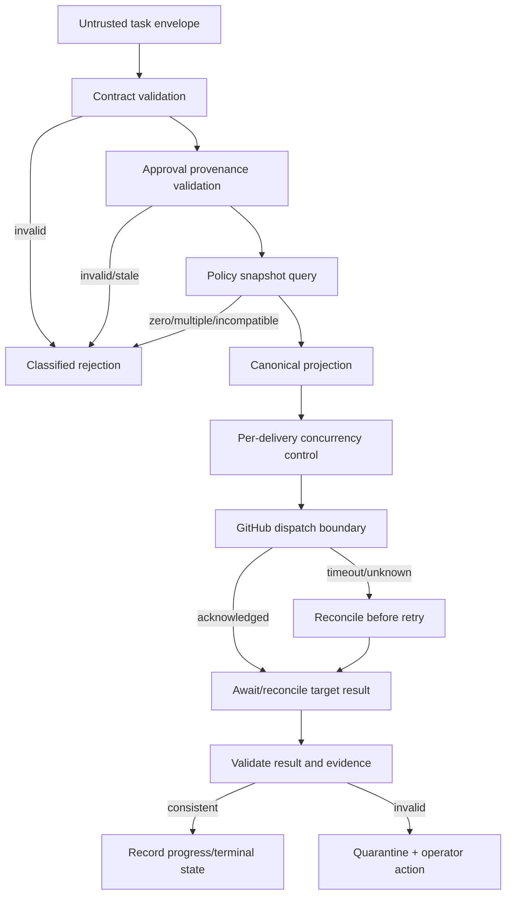
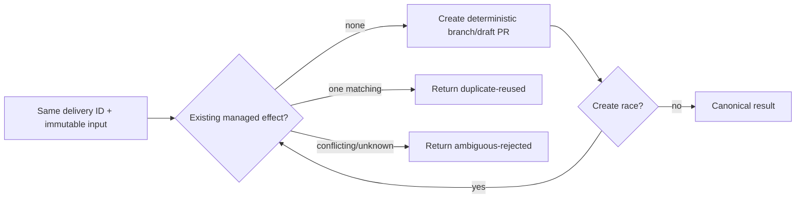

# Data Flow Design

## Data classes and boundaries

| Flow | Producer → consumer | Validation / transformation | Output |
| --- | --- | --- | --- |
| Task intake | Planning authority → Admission | Authenticate source; validate exact task contract and approval provenance | Admitted task or rejection |
| Policy resolution | Registry/release authority → Router | Validate snapshot/version/integrity; filter without broadening | One route or rejection |
| Input projection | Router domain → Delivery | Copy canonical semantics; add stable delivery/correlation identity and explicit mode | Execution input |
| Dispatch | Delivery adapter → Target workflow | Exact endpoint, scoped credential, canonical bytes | Attempt acknowledgement or uncertainty |
| Result | Target → Result interpreter | Validate contract/version/identity/status/evidence | Progress/terminal control-plane state |
| Operations | All components → telemetry/audit | Minimize, sanitize, classify, correlate | Metrics/logs/traces/evidence links |

## Command and event flow

Commands express requested actions: `AdmitTask`, `RouteDelivery`, `DispatchDelivery`, `ReconcileDelivery`, `VerifyTarget`, and `PublishRelease`. Facts may be recorded as `TaskAdmitted`, `RouteRejected`, `DispatchAttempted`, `DispatchAcknowledged`, `DeliveryUncertain`, `ResultAccepted`, `TargetIsolated`, and `ReleasePublished`. Names describe conceptual semantics; no messaging technology is required.

## At-least-once redelivery

This target obligation yields exactly-once externally visible publication effects, not exactly-once AI execution.

## Data handling

Payloads contain only the minimum authorized engineering context and no secrets or prohibited personal/confidential data. Logs avoid raw payloads by default. Artifacts carry classification, owner, retention, and deletion policy. Integrity is protected by immutable GitHub identity and, where supported, digests/signatures. Repository boundaries are crossed only through interfaces catalogued in [Interface Architecture](InterfaceArchitecture.md).
