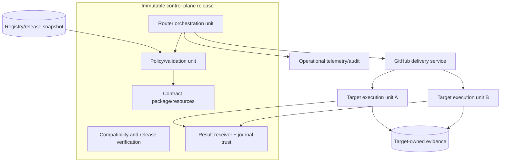

# Deployment Architecture

## Conceptual deployment

## Logical deployment units

- **Router unit:** ephemeral admission/routing/dispatch orchestration, deployed from an immutable release.
- **Contract distribution:** repository artifacts and installable validation resources; usable offline.
- **Policy snapshot:** reviewed registry plus release metadata; immutable during an invocation.
- **Verification units:** read-only contract, static, compatibility, security and release checks.
- **Result receiver unit:** reusable workflow plus a self-pinned composite
  action containing the receiver and journal-author policy at the same immutable
  control-plane commit; accepts only a scoped result credential from targets.
- **Target units:** independently deployed/owned workflows outside this repository.
- **Observability plane:** logically separate sinks/views with restricted evidence access.

No infrastructure vendor, region, runner type, database, queue, or network topology is prescribed.

## Scaling and availability

Router/domain operations are stateless over immutable snapshots and may scale horizontally. Partition concurrency by target and delivery; honor target maximum parallelism and never cancel an in-flight delivery merely to start a duplicate. Queue pressure must be visible and timeout-bounded. A target can be isolated independently. Degraded platform/target conditions yield pending/classified failure, never false success.

## Release, rollback and disaster recovery

Deploy the atomic compatibility unit by immutable identity only after
contract/security gates, every adapter's digest-bound complete conformance
report, non-recursive exact-file pin, separately resolved immutable tag/commit,
and the non-empty reviewed receiver trust policy pass the publication gate.
Disabled or unevaluated targets are blockers, not compatibility success.
Consumers adopt deliberately. Rollback pins the manifest's known-good release
and may disable a target without reverting unrelated targets. Recovery
reconstructs state from authoritative task, route/attempt audit, target evidence
and PR records; ephemeral runner state is never the sole recovery source.
Restore tests must prove identity/invariant preservation.

## Availability targets

Admission/routing targets 99.5% monthly availability excluding documented GitHub-wide outages. Validation/routing p95 targets 60 seconds excluding platform queue and target time. Measurement definitions and small-sample treatment are part of observability, not deployment assumptions.
