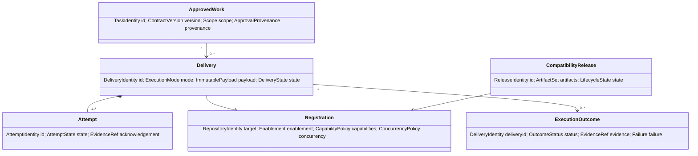

# Domain Model

## Ubiquitous language

| Term | Meaning |
| --- | --- |
| Canonical Task | Versioned expression of authoritative approved work; not itself proof of approval. |
| Admission | Control-plane decision that contract and approval provenance permit routing. |
| Delivery | One logical request to one target, stable across attempts. |
| Attempt | One transport invocation for a delivery. |
| Registration | Governed policy describing an eligible target and interface. |
| Execution Result | Canonical progress or terminal outcome asserted by a target. |
| Evidence | Durable reference supporting an assertion; absence is not success. |
| Compatibility Release | Immutable unit binding mutually dependent control-plane artifacts. |

## Aggregates and entities

### Aggregate roots

- **ApprovedWork:** owns task identity, declared scope, source reference, requirements trace, and approval provenance. Lifecycle is authored → approved/withdrawn/stale. The planning authority owns its truth.
- **Delivery:** owns immutable execution input, logical identity, attempts, and reconciled state. The control plane owns routing/attempt records; the target owns execution facts.
- **Registration:** owns one target's policy and enablement state. The control plane owns it; the target owner supplies verified capability evidence.
- **CompatibilityRelease:** owns the compatible artifact set and lifecycle. Published identities never move.

## Value objects

`TaskIdentity`, `DeliveryIdentity`, `CorrelationIdentity`, `RepositoryIdentity`, `ContractVersion`, `ReleaseIdentity`, `ExecutionMode`, `Scope`, `ApprovalProvenance`, `EvidenceReference`, `FailureClassification`, `ConcurrencyPolicy`, and `PublicationPolicy` are immutable, validated by value, and carry no infrastructure behavior.

## Business invariants

1. One delivery references exactly one admitted task, target registration, mode, contract version, and release identity.
2. A task may produce a new delivery only for materially distinct authorized work; the same logical work retains its delivery identity.
3. Attempts retain the delivery's immutable payload.
4. Only an enabled compatible registration is selectable, and selection cardinality is one.
5. Verify outcomes have no branch or PR; implement publication, if any, is one managed draft PR.
6. Duplicate reuse is valid only when ownership marker and immutable fields match; ambiguity is terminally rejected.
7. Cancellation/failure cannot be represented as success. A terminal result cannot regress to progress.
8. Approval withdrawal or material task change before dispatch invalidates admission; policy defines handling after acknowledged dispatch.
9. Evidence references must be access-controlled, integrity-preserving, and correlated to the same delivery.

## Conceptual ownership

No database schema is prescribed. Durable state may reside in GitHub records/artifacts or future stores, provided aggregate invariants, immutable identity, auditability, access control, retention, and reconciliation behavior remain intact.
