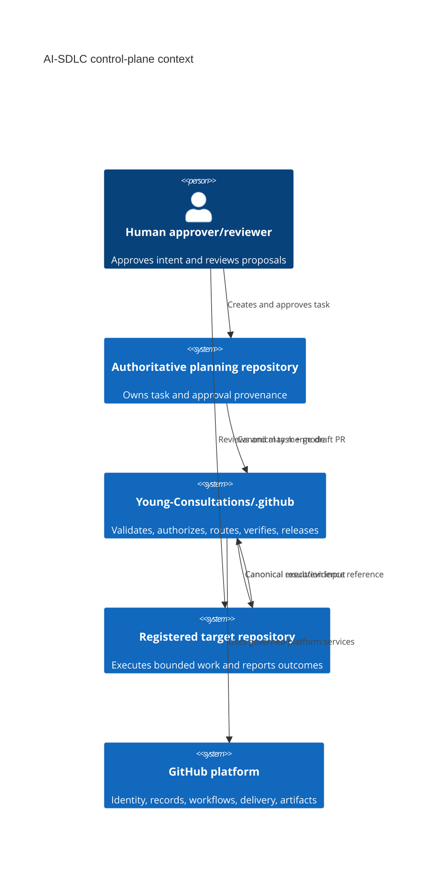
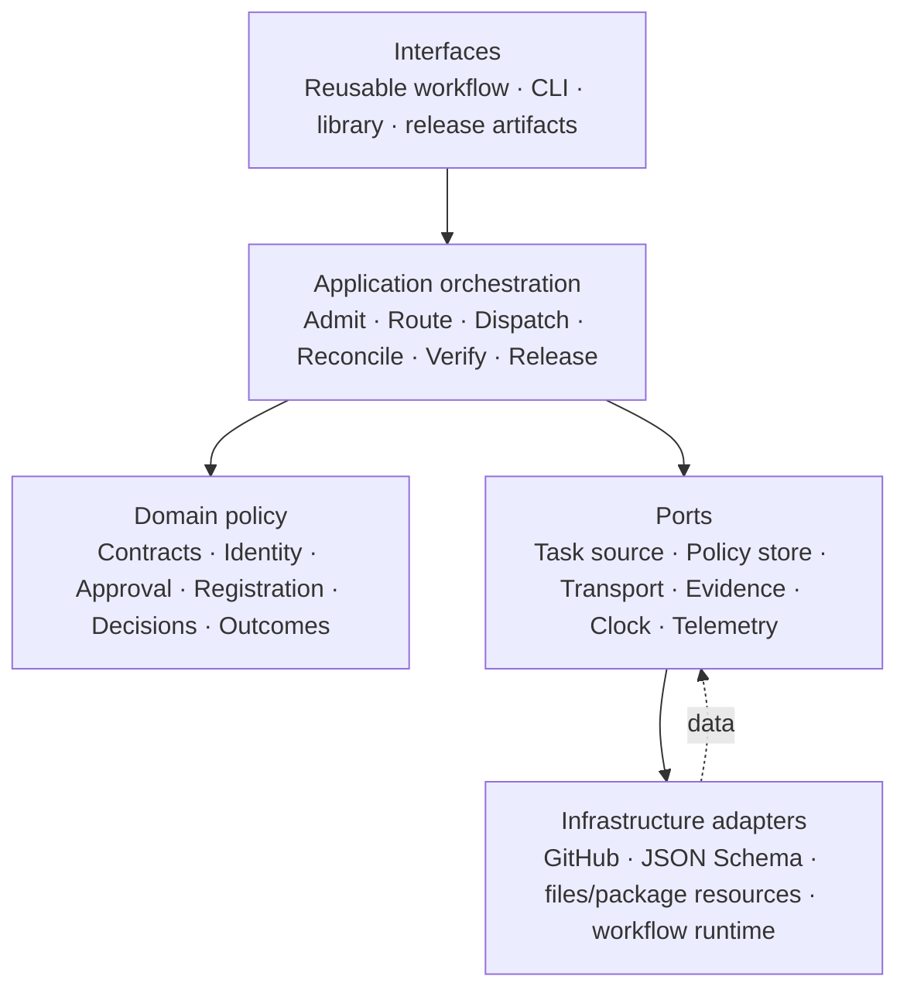
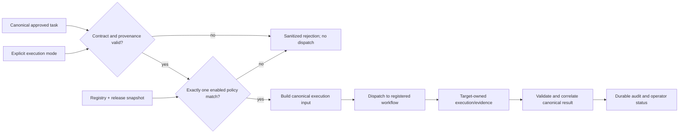

# High-Level Design

## Context and decomposition

## Architectural layers

Dependencies point inward. Domain policy has no dependency on GitHub Actions, a filesystem layout, a programming language, or a schema-validation library.

## Subsystems and responsibilities

| Subsystem | Responsibility | Owns | Does not own |
| --- | --- | --- | --- |
| Contract governance | Define semantics and compatibility | Canonical contract definitions and examples | Repository-specific fields |
| Admission and authorization | Establish task validity and human approval provenance | Admission decision/evidence | Approval decision itself |
| Registration and routing | Resolve one eligible destination | Registry policy and route decision | Target implementation |
| Delivery coordination | Send unchanged canonical request safely | Dispatch attempt metadata | Transactional execution |
| Result and recovery | Validate, correlate, classify, reconcile | Canonical control-plane interpretation | Target evidence creation |
| Compatibility assurance | Verify integration without side effects | Conformance evidence | Production implementation |
| Release governance | Bind compatible artifacts immutably | Release manifest/lifecycle | Consumer deployment |
| Operations | Expose safe diagnostic state | Control-plane telemetry | GitHub platform internals |

## Primary information flow

## Ownership and trust boundaries

Crossing from planning to control plane, configuration to policy core, control plane to GitHub transport, and target result to control plane requires validation. The control plane trusts no payload merely because it originated in the organization. Credential possession does not imply task approval. Target success is authoritative only when its identity, contract version, delivery identity, and evidence satisfy the result contract.

## External dependencies

- **GitHub identity, repositories, Actions, API, artifacts, issues, and pull requests:** known platform dependency; availability and delivery are not controlled here.
- **Planning repository:** contractually supplies authoritative task and approval provenance; internal representation is unknown.
- **Registered targets:** contractually consume inputs, enforce local authorization/idempotency, and emit results; internals are unknown.
- **AI executor/provider:** target-owned and optional for implement mode; no control-plane credentials or authority.
- **Schema/validation ecosystem:** replaceable implementation dependency constrained by the canonical JSON Schema dialect.

## Scale and availability model

Scale is primarily by independent deliveries and target partition. Per-target concurrency policy prevents overload; per-delivery serialization prevents duplicate publication without globally serializing unrelated work. Stateless decision services may scale horizontally when all instances use the same immutable release and registry snapshot. Durable GitHub records and target evidence support recovery after ephemeral workflow loss.
