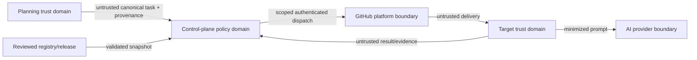

# Security Architecture

## Security objectives

Preserve human authority, repository isolation, least privilege, payload/evidence integrity, confidential data minimization, and attributable decisions. A credential authenticates an actor but does not itself prove approval or authorize arbitrary targets.

## Trust boundaries

Every arrow requires identity, integrity, version, authorization and semantic validation.

## Authentication and authorization

- Prefer short-lived workload identity or narrowly scoped app/repository tokens; never pass control-plane credentials to targets or AI providers.
- Authorize caller, authoritative task/approval, target, workflow, mode, task type, contract/release, and scope independently.
- Separate read-only validation/compatibility credentials from dispatch credentials; only the dispatch adapter receives the latter.
- The result receiver loads trusted journal-author identities from
  `config/codex-result-trust.json` through a self-pinned composite action at the
  same immutable control-plane commit as the reusable workflow. It never uses
  caller-associated workflow context to select policy. Targets supply only the
  result-delivery credential and cannot add, replace, or inherit the author
  allowlist. Empty or invalid policy denies all results.
- Govern registry enablement, workflow permissions, security policy and releases with designated independent human review and verified identities where supported.
- Protected default branches and environments enforce that automation cannot clear draft status, merge, deploy, or change settings.

## Secrets and data protection

Secrets live in an approved secret service/environment, are never embedded in contracts, prompts, source, logs, artifacts or diagnostics, and are rotated/revoked on exposure or offboarding. Classify/minimize payloads; prohibit secrets and disallowed personal/confidential data; sanitize failure messages; apply least-access retention/deletion to prompts, logs, artifacts and results.

## Integrity, auditability and confidentiality

Pin third-party automation by immutable identity and verify release/schema/package digests. Preserve actor, authoritative source, approval, release/registry identity, delivery/attempt identity, policy decision, permission context, target result and human review as tamper-evident references. Restrict raw evidence while exposing safe metadata. Signing is required where reliable organization enforcement exists; exceptions need explicit risk acceptance.

## Threat considerations

| Threat | Control |
| --- | --- |
| Forged/stale approval | Verify authoritative provenance, actor and freshness; fail closed. |
| Confused deputy/arbitrary target | Allowlisted exact repository/workflow and scoped credential. |
| Payload/schema smuggling | Closed schemas, format/invariant validation on both sides. |
| Prompt injection/scope expansion | Treat task text as data; bounded scope; target policy; no credential/tool authority from prose. |
| Duplicate/race publication | Stable delivery ID, deterministic marker/branch, preflight, requery, ambiguity rejection. |
| Supply-chain compromise | Immutable action/dependency pins, scanning, protected updates, release integrity. |
| Secret leakage | Minimization, redaction, log scanning, access/retention policy. |
| False success/evidence substitution | Authenticated correlated target evidence; absence/conflict is not success. |
| Caller-controlled journal trust | Immutable control-plane author allowlist; target-supplied trust fields or secrets are rejected. |
| Privilege escalation via PR | Draft-only publication, protected branches, human review, no auto-merge. |

Security tests include negative authorization, permissions, secret canaries, dependency/action integrity, malformed contracts, concurrency, evidence substitution and provider-boundary threat scenarios.
