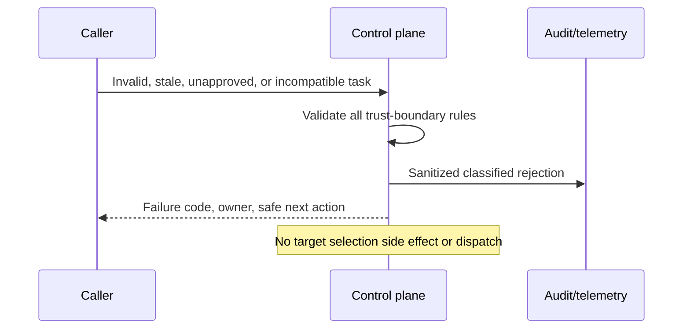
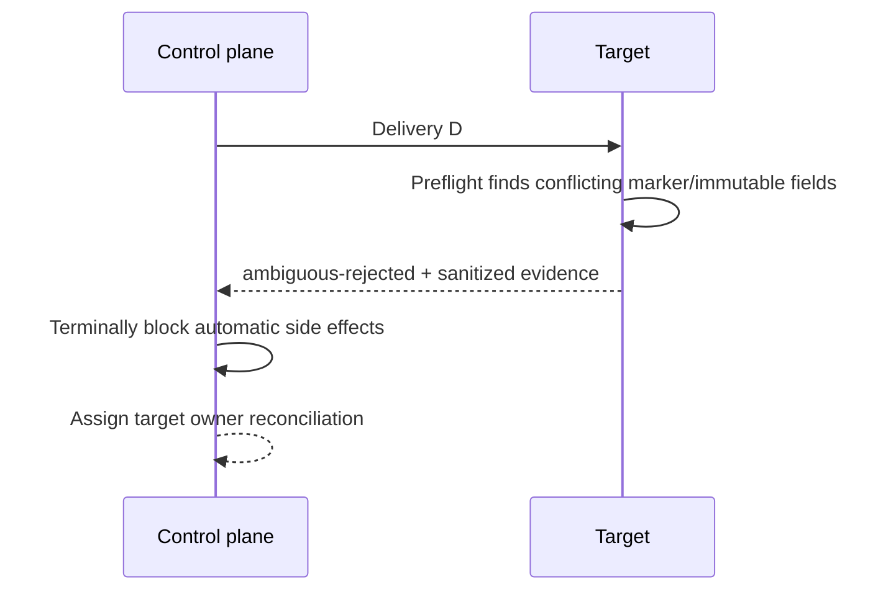
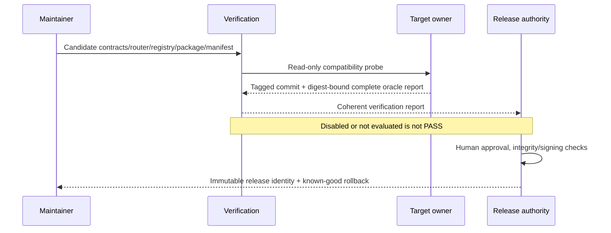

# Sequence Diagrams

## Primary implementation flow

```mermaid
sequenceDiagram
  actor H as Human approver
  participant P as Planning authority
  participant C as Control plane/router
  participant G as GitHub transport
  participant T as Target workflow
  participant R as Human reviewer
  H->>P: Explicitly approve bounded task
  P->>C: Canonical task + implement mode + provenance
  C->>C: Validate contract, approval, registry and release
  C->>G: workflow_dispatch exact JSON + concurrency inputs
  G-->>C: Accepted acknowledgement
  G->>T: At-least-once delivery
  T->>T: Revalidate, authorize, idempotency preflight
  T->>T: Implement and validate bounded change
  T->>G: Publish one managed draft PR
  participant X as Result receiver
  T->>X: Canonical result + scoped result credential
  X->>X: Load immutable author policy; authenticate, validate, deduplicate, retain
  X->>P: Idempotent correlated result projection
  P-->>H: Status + validation + draft-PR link
  R->>G: Review; optionally merge under human policy
```

Normal `TC-MVP-CI-001` replaces planning, transport, target execution, Codex,
publication, receiver, and source projection with deterministic adapters. It
creates no real branch or pull request and consumes no Codex resources. The
real sequence is exercised only by separately gated `TC-MVP-E2E-001`.

## Verification alternate flow

```mermaid
sequenceDiagram
  participant O as Integrator/operator
  participant C as Control plane
  participant T as Registered target
  O->>C: Canonical smoke task + verify
  C->>T: Validated execution input
  T->>T: Validate authorization, interface and repository readiness
  Note over T: No AI executor, branch, source mutation, or PR
  T-->>C: verified result; null publication fields
  C-->>O: Compatibility evidence
```

## Admission failure



## Lost acknowledgement and redelivery

```mermaid
sequenceDiagram
  participant C as Control plane
  participant G as Transport
  participant T as Target
  C->>G: Dispatch delivery D / immutable payload P
  G->>T: Deliver D/P
  G--xC: Acknowledgement lost
  C->>C: Mark uncertain; reconcile
  C->>G: Retry D/P only when safe
  G->>T: Redeliver D/P
  T->>T: Find one matching managed effect
  T-->>C: duplicate-reused + same evidence
```

## Ambiguous ownership failure



## Release/adoption flow


