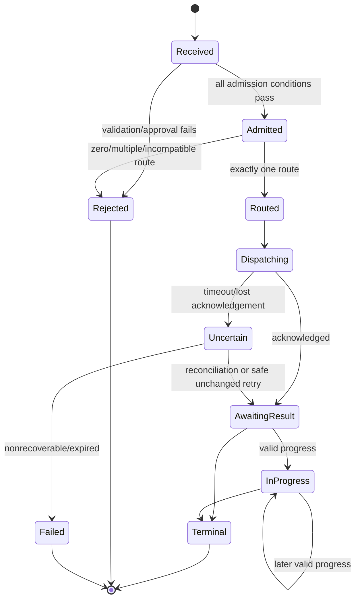
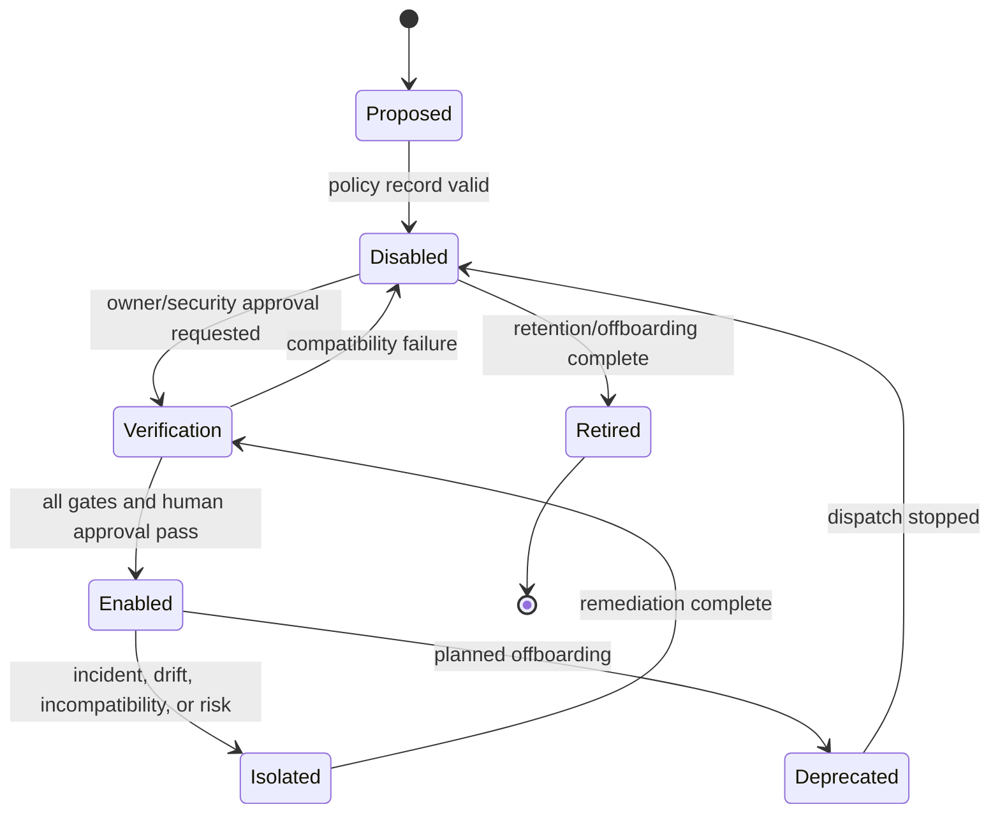
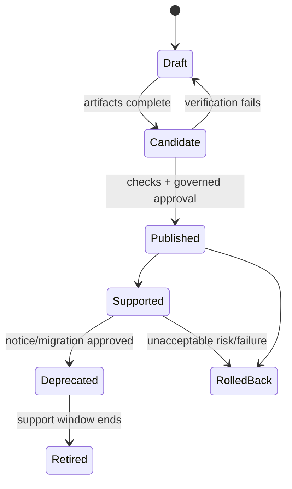

# State Models

## Delivery lifecycle

Terminal outcome variants include `succeeded`, `verified`, `duplicate-reused`, `ambiguous-rejected`, `cancelled`, `rejected`, and `failed` as supported by the active contract. Entry requires a schema-valid, identity-consistent result and required evidence. Terminal states cannot regress. Unknown/absent evidence remains awaiting, uncertain, or failed—not successful.

## Registration lifecycle

Only `Enabled` is routable. Isolation affects one target without preventing unrelated target routing.

## Compatibility release lifecycle

Published identity and contents are immutable. Rollback selects a recorded known-good identity; it never mutates the failed release.

## Approval/admission lifecycle

An authored task becomes `Approved` only through authoritative human action. It may become `Stale` after material task/policy change or `Withdrawn` by authority. Admission requires `Approved` and fresh provenance at the decision point. A prior admission does not silently authorize changed work.
