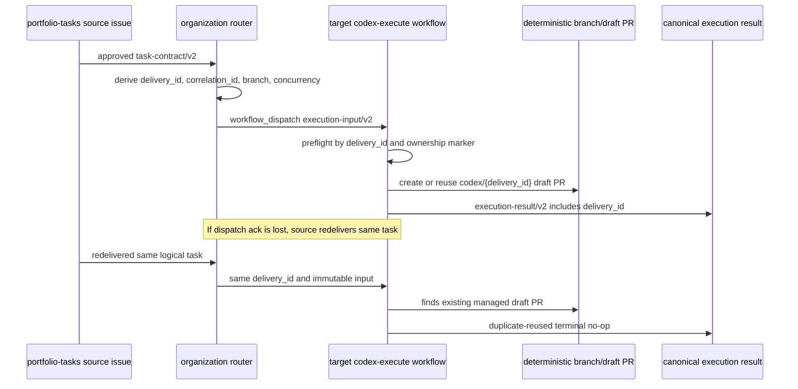

# Organization Codex router

The organization router is a policy boundary between canonical planning output and repository execution. Portfolio intake supplies one JSON `task_payload` conforming to `task-contract.schema.json`; the router never interprets repository-specific fields.

## Canonical route

The reusable `.github/workflows/codex-router.yml` accepts only `task_payload`,
`execution_mode`, and the narrowly scoped dispatch secret. It invokes
`actions/codex-router` at its own immutable release tag, so caller context cannot
select policy code. The bundle checks out one activation snapshot. The router:

1. validates `ai-sdlc-contract/v2`, approval status, the `codex` executor, and an empty dependency list;
2. authorizes capability against `config/codex-repositories.json` and current activation against `config/codex-activation.json`;
3. constructs and schema-validates one execution input;
4. writes one idempotent admission marker containing the release and activation
   identities; and
5. dispatches the registered target through `workflow_dispatch` with exactly two
   required strings: `execution_input_json`, containing the complete canonical
   input, and `concurrency_group`, equal to the canonical concurrency value.

The reusable router defaults `execution_mode` to `implement`. The router smoke
workflow explicitly selects `verify`; the router never derives the mode from
task type or natural-language instructions. Both modes retain normal contract,
registry, authorization, correlation, target, and concurrency validation.

`task_id` becomes the unchanged execution `correlation_id`. The requested branch is deterministically derived from it, so retrying the same attempt cannot request multiple draft-PR branches. Draft-only execution is mandatory; this workflow cannot merge.

Rejected routes return a deterministic JSON result and one of: `contract-validation`, `authorization`, `dependency`, `repository-routing`, `publication`, or `unknown`.

## Concurrency

All `implement` deliveries use one concurrency group per target. The current sole
enabled target is therefore serialized regardless of the legacy v2
`parallel_safe` field. Verify deliveries use a separate source-bound read-only
group. The target workflow applies the canonical group with
`cancel-in-progress: false`.

## Caller

```yaml
jobs:
  route:
    uses: Young-Consultations/.github/.github/workflows/codex-router.yml@ai-sdlc-v2.4.1
    permissions:
      contents: read
      actions: read
    with:
      task_payload: ${{ needs.portfolio-task.outputs.canonical_task_payload }}
    secrets:
      CODEX_ROUTER_TOKEN: ${{ secrets.CODEX_ROUTER_TOKEN }}
```

The token should be a repository-scoped token or GitHub App installation token able to dispatch only registered target workflows.

The 2.4.1 reference is a release candidate and must not be used for REAL work
until its governed immutable tag is published. See [the 2.4.1 release
procedure](releases/2.4.1.md). Never replace the tag with a branch name.

## Registry changes

Every immutable capability entry contains only shared policy keys:
`workflow_ref`, `allowed_task_types`, `codex_environment`,
`max_parallel_tasks`, `draft_pr_only`, `contract_version`, `idempotency`, and
`conformance`. Pending conformance is `null`; reviewed evidence binds the exact
adapter ref/commit, fixture and compatibility identities, report path/digest,
PASS status, and activation sufficiency. Mutable booleans in
`config/codex-activation.json` are the sole live enable/disable state. Run
`python3 scripts/codex_router.py validate-registry` in CI whenever registry or
router policy changes. Repository differences belong only in this registry;
aliases and target-specific parsing are prohibited.

An enabled target's `workflow_ref` must end in a target-owned release tag named
`codex-adapter-vMAJOR.MINOR.PATCH` (or a SemVer-style prerelease such as
`codex-adapter-v2.1.0-rc.1`). GitHub CLI accepts that tag through
`gh workflow run --ref`; raw commit SHAs are deliberately rejected because the
workflow-dispatch interface accepts a branch or tag name. Target owners must
create the tag from the reviewed adapter commit and must never move, delete, or
recreate it. Branch refs remain valid only while a registration is disabled.

## Contract verification gate

`AI-SDLC Contract Tests` is the single canonical read-only gate for shared
schemas and examples, the installed Python validation library, organization
router contracts, registry contracts, integration boundaries, and static
contract security checks. It supersedes the former `Router contract tests`
check. Update branch protection after the rename to require the new workflow's
job checks; do not retain the old check name as a duplicate compatibility path.

Verification moves outward from contracts toward execution and must occur in
this order:

1. `AI-SDLC Contract Tests`
2. `Router smoke test`
3. registered target-repository execution
4. full ChatGPT-to-draft-PR end-to-end tests

The first stage cannot execute Codex, dispatch a repository, mutate an issue,
create a branch, or open a pull request. The smoke and execution workflows are
intentionally retained as separate execution-level stages.

## Workflow inventory and ownership boundary

The organization repository owns these active workflows:

- `ai-sdlc-contract-tests.yml` validates schemas, the shared Python validator,
  registry policy, router behavior, and static contract boundaries;
- `codex-router.yml` is the reusable interface and its same-release
  `actions/codex-router` bundle is the only organization dispatch implementation;
- `codex-result-receiver.yml` is the sole implemented canonical result-return boundary; and
- `router-smoke-test.yml` exercises the router with read-only verification.

`Young-Consultations/.github` also owns the canonical schemas, shared Python
validator, and repository registry. Its control-plane workflows do not execute
repository changes. The separately authorized `.github` target adapter required
by RI-MVP-02 is planned implementation work and must not use control-plane
credentials or bypass router admission.

Registered target repositories (`.github`, `portfolio-tasks`, `consulting-playbook`, and
`slugger`) own their executor workflows. Each target consumes the canonical
`execution-input/v2` payload through `execution_input_json` (plus the transport
`concurrency_group`), performs verification or Codex implementation, and emits
`execution-result/v2`. Registry `codex_environment` values remain internal
organization routing configuration and are not independent workflow inputs.

## Sole shared control-plane authority

`Young-Consultations/.github` is the only supported cross-repository Codex
router and the only shared authority for AI-SDLC schemas, contract packages,
registry policy, routing validation, correlation and failure contracts,
compatibility tests, release policy, rollback policy, and deprecation policy.
Target repositories must not register local production routers as an alternate
control plane.

Slugger no longer authorizes production Codex runs from a local
`codex-ready`/`issue-to-codex.yml` issue path. `consulting-playbook` no longer
consumes schemas from `portfolio-tasks`. Both repositories consume the
canonical `ai-sdlc-contract/v2` contracts from this repository.

Enabled targets must pass read-only target-workflow compatibility verification
before the control-plane owner enables them in `config/codex-activation.json`.
The verifier requires the exact two-input dispatch interface, receiver
compatibility, immutable adapter tag/commit, and a digest-bound complete
`TC-MVP-CI-001` report with zero prohibited effects. The report binds a
non-recursive conformance pin of exact shared and target files; the registry
separately binds the adapter tag to the commit and report digest. Disabled targets are
`not-evaluated`, not PASS, unless an operator explicitly selects one for
pre-activation verification. Disabling one
target is the fail-closed rollback lever for that target and must not affect
other registered targets. If a shared router, package, schema, registry
contract, or compatibility behavior release must be rolled back, disable the
impacted registry entry where needed and restore the previous immutable release
pin according to `docs/releases.md`.

## At-least-once delivery and idempotent publication

The router and target workflows provide **at-least-once delivery with idempotent
consumers**. They do not implement a transactional exactly-once execution
protocol. GitHub `workflow_dispatch` can accept a dispatch even when the router
loses the acknowledgement, and Actions concurrency only serializes jobs in the
same group; it does not suppress a later sequential duplicate.

Each canonical execution input therefore carries an immutable `delivery_id`.
For v2 this value is the logical `task_id`, preserved separately from
`correlation_id` so tracing and idempotency semantics are explicit. The router
must preserve the same `delivery_id`, `correlation_id`, target repository,
requested branch, concurrency group, contract version, and immutable
instructions for redelivery. If a router-side delivery ledger is configured, a
repeated immutable payload is reported as `duplicate-delivery`; the same
`delivery_id` with altered immutable fields is rejected fail-closed.

Target repositories are the final safety boundary. A compatible
`codex-execute.yml` must derive its branch from `delivery_id`, perform preflight
PR/branch discovery before Codex execution or publication, publish only a draft
PR containing a machine-readable `ai-sdlc-delivery-id` marker, reuse exactly one
valid existing managed draft PR, recover create races by re-querying after
conflict, and fail closed on multiple matches, marker mismatch, non-draft or
closed/merged PRs, or a matching branch owned by another delivery. Canonical
results must include `delivery_id` and report whether the target executed,
returned `duplicate-reused`, rejected ambiguity, or failed.

Compatibility inspection validates the wrapper's exact dispatch and receiver
interfaces. It does not infer idempotency from source-code keywords. The
non-recursive conformance pin binds the exact adapter and harness blobs, and the
complete shared oracle is the behavioral proof. Preflight must independently
observe branch existence and pull-request state; disagreement fails before the
executor.

The target returns that result through the immutable organization receiver with
only `CODEX_RESULT_TOKEN`. Journal-author trust is loaded from
`config/codex-result-trust.json` by the receiver's self-pinned control-plane
action at the same release commit; a target-supplied author allowlist is
incompatible and rejected.

Operator recovery for ambiguous state is manual: inspect all branches and PRs
with the `ai-sdlc-delivery-id` marker, close or relabel invalid duplicates,
preserve at most one open managed draft PR and one deterministic branch for the
canonical delivery, then redeliver the unchanged task.


