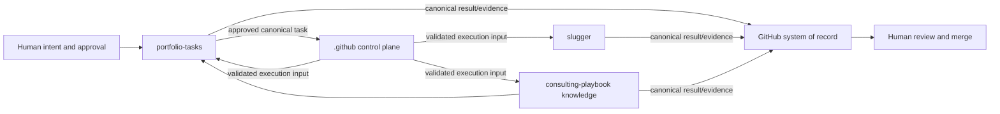

# Organization Architecture Context

## Placement and relationships

The organization is a modular AI-assisted delivery platform with GitHub as system of record. The `.github` repository is the policy and integration control plane. `portfolio-tasks` is the portfolio intake, governance, approval, and initiation plane. `slugger` is an AI software-factory target. `consulting-playbook` owns consulting knowledge and may produce governed work. Target repositories remain autonomous execution domains behind the shared contract.

## Ownership and governance

| Concern | Accountable owner | Control-plane role |
| --- | --- | --- |
| Organization intent and risk | Organization owner | Publish approved boundaries and evidence |
| Requirements/architecture | Engineering lead | Maintain cross-repository coherence |
| Contracts, registry, router, release | Control-plane maintainers | Own and operate governance lifecycle |
| Intake, priority, approval | Portfolio owner | Validate evidence; never decide approval |
| Target implementation/publication | Target maintainer | Specify and verify interface obligations |
| Identity, environments, secrets | Organization security owner | Define least-privilege requirements and audits |
| Merge and production authorization | Authorized humans | Prohibit automation from acquiring authority |

Configuration ownership follows responsibility: shared registry and contract configuration is controlled here; source issue/project configuration belongs to portfolio management; execution and branch configuration belongs to each target; organization rulesets, identities, and enterprise settings belong to organization administrators.

## Shared services and documentation

The repository produces shared schemas, validation, reusable routing, compatibility verification, failure/correlation semantics, release metadata, onboarding, security guidance, and—where approved—community-health templates. These are versioned products with named owners, support windows, and immutable adoption points rather than copied snippets.

## Repository lifecycle

Propose through a traced issue; assess boundary/security/compatibility impact; update requirements where behavior changes; implement and verify on a branch; obtain required human reviews; merge through protection; create an immutable release from the reviewed commit; coordinate target adoption; observe; deprecate with notice; retire only after migration; and preserve records and rollback points. Archival requires organization approval, replacement interfaces, consumer migration, retention of authoritative records, and revocation of credentials.
